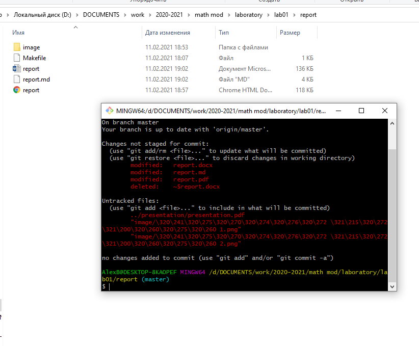

---
# Front matter
lang: ru-RU
title: "Отчёт по лабораторной работе"
subtitle: "Лабораторная №1"
author: "Шемякин Алексей Александрович"

# Formatting
toc-title: "Содержание"
toc: true # Table of contents
toc_depth: 2
lof: true # List of figures
lot: true # List of tables
fontsize: 12pt
linestretch: 1.5
papersize: a4paper
documentclass: scrreprt
polyglossia-lang: russian
polyglossia-otherlangs: english
mainfont: PT Serif
romanfont: PT Serif
sansfont: PT Sans
monofont: PT Mono
mainfontoptions: Ligatures=TeX
romanfontoptions: Ligatures=TeX
sansfontoptions: Ligatures=TeX,Scale=MatchLowercase
monofontoptions: Scale=MatchLowercase
indent: true
pdf-engine: lualatex
header-includes:
  - \linepenalty=10 # the penalty added to the badness of each line within a paragraph (no associated penalty node) Increasing the value makes tex try to have fewer lines in the paragraph.
  - \interlinepenalty=0 # value of the penalty (node) added after each line of a paragraph.
  - \hyphenpenalty=50 # the penalty for line breaking at an automatically inserted hyphen
  - \exhyphenpenalty=50 # the penalty for line breaking at an explicit hyphen
  - \binoppenalty=700 # the penalty for breaking a line at a binary operator
  - \relpenalty=500 # the penalty for breaking a line at a relation
  - \clubpenalty=150 # extra penalty for breaking after first line of a paragraph
  - \widowpenalty=150 # extra penalty for breaking before last line of a paragraph
  - \displaywidowpenalty=50 # extra penalty for breaking before last line before a display math
  - \brokenpenalty=100 # extra penalty for page breaking after a hyphenated line
  - \predisplaypenalty=10000 # penalty for breaking before a display
  - \postdisplaypenalty=0 # penalty for breaking after a display
  - \floatingpenalty = 20000 # penalty for splitting an insertion (can only be split footnote in standard LaTeX)
  - \raggedbottom # or \flushbottom
  - \usepackage{float} # keep figures where there are in the text
  - \floatplacement{figure}{H} # keep figures where there are in the text
---

# Цель работы

Научиться использовать git, а также познакомиться
с основными возможностями разметки Markdown для оформления отчётов.

# Задание

Создать Git репозиторий, придерживаясь структуры рабочего пространства.
Написать отчет по лабораторной работе в Markdown. 
Загрузить в репозиторий отчёт в формате: docx и pdf. 
Сделать презентацию.

# Теоретическая справка

GitHub — онлайн-хостинг репозиториев, обладающий всеми функциями системы контроля версий и функциональностью управления (в него входит всё то, что поддерживает Git). Вместе с Git он даёт разработчикам возможность сохранять их код онлайн, а затем взаимодействовать с другими разработчиками в разных проектах.

Git — это инструмент, позволяющий реализовать распределённую систему контроля версий.

GitHub — это сервис для проектов, использующих Git.

Репозиторий — каталог файловой системы, в котором могут находится: файлы журналов конфигураций и операций, выполняемых над репозиторием, а также сами контролируемые файлы.

Репозиторий бывает:

- локальный (расположен непосредственно в памяти компьютера разработчика, в нем происходит разработка и фиксация изменений, после чего можно отправить на удалённый репозиторий).
- удалённый (находится на сервере, может быть приватным – доступным ограниченному числу лиц, и публичным – open source).

В GitHub входит:

- система контроля доступа.
- багтрекинг (отслеживание истории действий над файлами и, при необходимости, переход на более ранние версии).
- возможность управлять задачами и справками для проектов.

Термины:

 - Запушить = 'git push'. Команда git push используется для выгрузки содержимого локального репозитория в удаленный репозиторий. Она позволяет передать коммиты из локального репозитория в удаленный.
 - Закоммитить = 'git commit'. Команда git commit фиксирует изменения любых файлов, входящих в репозиторий.

# Выполнение лабораторной работы

Создали для удобства структуру рабочего пространства (рис. -@fig:001)

{ #fig:001 width=70% }

Создали репозиторий 2020_2021_mathmod, сделали первые коммиты и запушили шаблоны отчёта и презентации.  (рис. -@fig:002)

{ #fig:002 width=70% }

Написали сейчас отчёт и решили его запушить. Сначала проверяем состояние в консоли. (рис. -@fig:003)

{ #fig:003 width=70% }

Добавляем все файлы в локальный репозиторий. Проверяем состояние. (рис. -@fig:004)

{ #fig:004 width=70% }

Делаем коммит. Делаем пуш на ветку мастер. (рис. -@fig:005)

{ #fig:005 width=70% }

Заходим на гитхаб и проверяем коммит. (рис. -@fig:006)

{ #fig:006 width=70% }

# Выводы

Мы научились использовать git, а также познакомились
с основными возможностями разметки Markdown для оформления отчётов.
