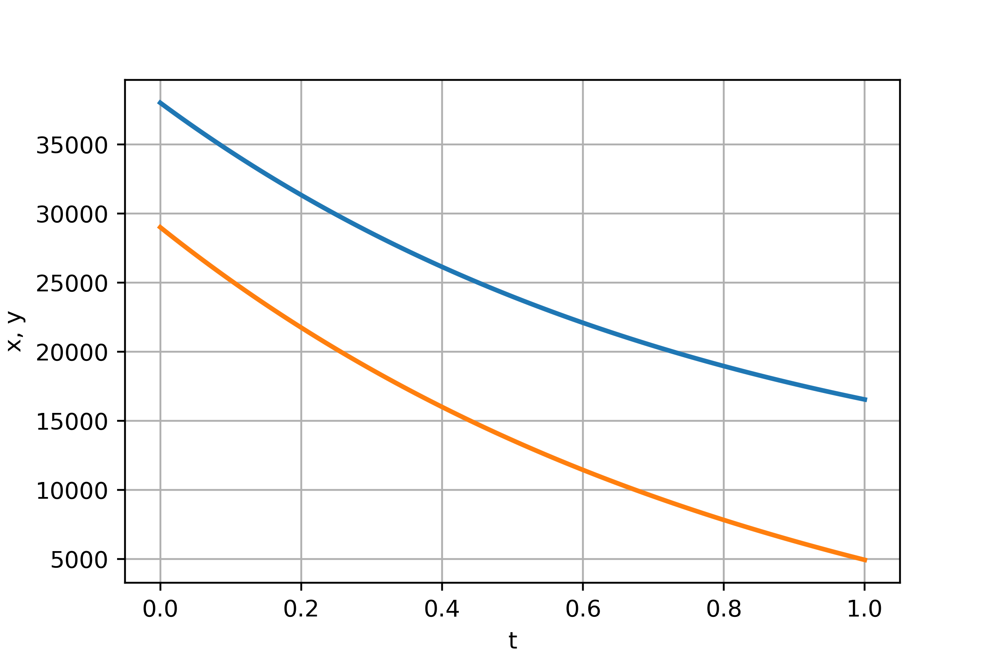
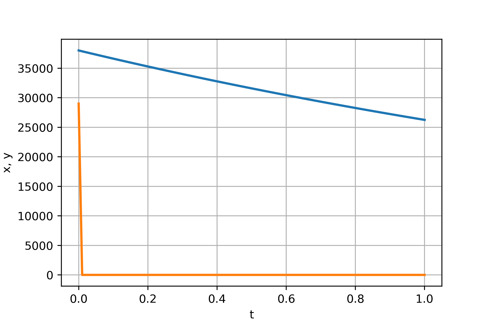

---
## Front matter
lang: ru-RU
title: Модель боевых действий. Вариант 44
author: |
	Alexey A. Shemyakin\inst{1}
institute: |
	\inst{1}RUDN University, Moscow, Russian Federation

date: 27 February, 2021 Moscow, Russian Federation

## Formatting
toc: false
slide_level: 2
theme: metropolis
mainfont: PT Serif
romanfont: PT Serif
sansfont: PT Sans
monofont: PT Mono
mainfontoptions: Ligatures=TeX
romanfontoptions: Ligatures=TeX
header-includes: 
 - \metroset{progressbar=frametitle,sectionpage=progressbar,numbering=fraction}
 - '\makeatletter'
 - '\beamer@ignorenonframefalse'
 - '\makeatother'
aspectratio: 43
section-titles: true
---

# Who is this guy

## Who am i

- Я, Шемякин Алексей Александрович, — студент РУДН с 2018 - по
настоящее время. Учусь на направлении Фундаментальная информатика и
информационные технологии. 

## Цель выполнения лабораторной работы

Рассмотреть некоторые простейшие модели боевых действий – модели
Ланчестера. В противоборстве могут принимать участие как регулярные войска,
так и партизанские отряды. В общем случае главной характеристикой соперников
являются численности сторон. Если в какой-то момент времени одна из
численностей обращается в нуль, то данная сторона считается проигравшей (при
условии, что численность другой стороны в данный момент положительна).

## Задачи выполнения лабораторной работы

1. Изучить три случая модели Ланчестера
2. Построить графики изменения численности войск
3. Определить победившую сторону

## Теоретическая справка
Рассмотреть три случая ведения боевых действий: 

1. Боевые действия между регулярными войсками
2. Боевые действия с участием регулярных войск и партизанских отрядов
3. Боевые действия между партизанскими отрядами 

## Теоретическая справка
В этом случае модель боевых действий между регулярными войсками
описывается следующим образом: 

$$
 \begin{cases}
	\frac{dx}{dt}= -a(t)x(t) - b(t)y(t) + P(t)
	\\   
	\frac{dy}{dt}= -c(t)x(t) - h(t)y(t) + Q(t)
 \end{cases}
$$

## Теоретическая справка
Во втором случае в борьбу добавляются партизанские отряды. Нерегулярные войска в отличии от постоянной армии менее уязвимы, так как действуют скрытно, в этом случае сопернику приходится действовать неизбирательно, по площадям, занимаемым партизанами. Поэтому считается, что темп потерь партизан, проводящих свои операции в разных местах на некоторой известной территории, пропорционален не только численности армейских соединений, но и численности самих партизан. В результате модель принимает вид:

$$
 \begin{cases}
	\frac{dx}{dt}= -a(t)x(t) - b(t)y(t) + P(t)
	\\   
	\frac{dy}{dt}= -c(t)x(t)y(t) - h(t)y(t) + Q(t)
 \end{cases}
$$

## Теоретическая справка

Модель ведение боевых действий между партизанскими отрядами с учетом предположений, сделанном в предыдущем случаем, имеет вид:

$$
 \begin{cases}
	\frac{dx}{dt}= -a(t)x(t) - b(t)x(t)y(t) + P(t)
	\\   
	\frac{dy}{dt}= -h(t)y(t) - c(t)x(t)y(t) + Q(t)
 \end{cases}
$$

## Условия задачи

Между страной $X$ и страной $Y$ идет война. Численность состава войск исчисляется от начала войны, и являются временными функциями $x(t)$ и $y(t)$ В начальный момент времени страна $X$ имеет армию численностью 38000 человек, а в распоряжении страны $Y$ армия численностью в 29000 человек. Для упрощения модели считаем, что коэффициенты $a, b, c, h$ постоянны. Также считаем $P(t), Q(t)$ непрерывные функции. Постройте графики изменения численности войск армии $X$ и армии $Y$ для следующих случаев:

## Модель боевых действий между регулярными войсками

$$
 \begin{cases}
	\frac{dx}{dt}= -a(t)x(t) - b(t)y(t) + P(t)
	\\   
	\frac{dy}{dt}= -c(t)x(t) - h(t)y(t) + Q(t)
 \end{cases}
$$

{ #fig:001 width=50% }

## Модель ведение боевых действий с участием регулярных войск и партизанских отрядов

$$
 \begin{cases}
	\frac{dx}{dt}= -a(t)x(t) - b(t)y(t) + P(t)
	\\   
	\frac{dy}{dt}= -c(t)x(t) - h(t)y(t) + Q(t)
 \end{cases}
$$

{ #fig:002 width=50% }

## Результаты выполнения лабораторной работы

В результате проделанной работы мы познакомились с моделью "Войны и сражения". Проверили, как работает модель в различных ситуациях, построили графики $y(t)$ и $x(t)$ в рассматриваемых случаях.

## {.standout}

Спасибо за внимание!
