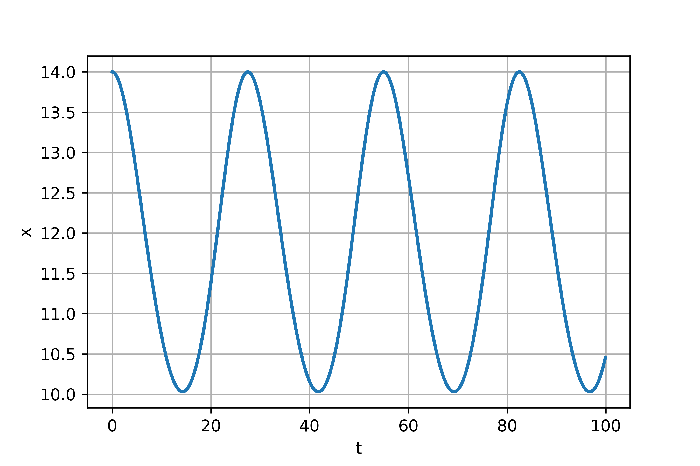
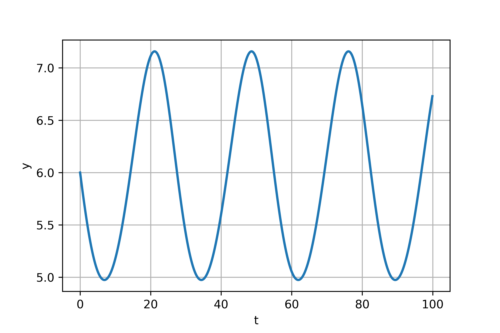

---
## Front matter
lang: ru-RU
title: Модель хищник-жертва
author: |
	 Alexey A. Shemyakin\inst{1}

institute: |
	\inst{1}RUDN University, Moscow, Russian Federation

date: 27 March, 2021, Moscow, Russian Federation

## Formatting
mainfont: PT Serif
romanfont: PT Serif
sansfont: PT Sans
monofont: PT Mono
toc: false
slide_level: 2
theme: metropolis
header-includes: 
 - \metroset{progressbar=frametitle,sectionpage=progressbar,numbering=fraction}
 - '\makeatletter'
 - '\beamer@ignorenonframefalse'
 - '\makeatother'
aspectratio: 43
section-titles: true

---

# Цели и задачи работы

## Цель лабораторной работы

Изучить модель хищник-жертва

## Задание к лабораторной работе

1.	Построить график зависимости $x$ от $y$ и графики функций $x(t)$, $y(t)$
2.	Найти стационарное состояние системы

# Процесс выполнения лабораторной работы

## Теоретический материал 

Рассмотрим базисные компоненты системы.

1.	Численность популяции жертв и хищников зависят только от времени (модель не учитывает пространственное распределение популяции на занимаемой территории)
2.	В отсутствии взаимодействия численность видов изменяется по модели Мальтуса, при этом число жертв увеличивается, а число хищников падает
3.	Естественная смертность жертвы и естественная рождаемость хищника считаются несущественными 
4.	Эффект насыщения численности обеих популяций не учитывается 
5.	Скорость роста численности жертв уменьшается пропорционально численности хищников

## Теоретический материал 

$$
 \begin{cases}
	\frac{dx}{dt} = (-ax(t) + by(t)x(t))
	\\   
	\frac{dy}{dt} = (cy(t) - dy(t)x(t))
 \end{cases}
$$

Стационарное состояние системы определяется следующим образом: 
$$
	x_0=\frac{a}{b}, y_0=\frac{c}{d}
$$

## Условие задачи

Для модели «хищник-жертва»:

$$
 \begin{cases}
	\frac{dx}{dt} = (-0.21x(t) + 0.035y(t)x(t))
	\\   
	\frac{dy}{dt} = (0.25y(t) - 0.021y(t)x(t))
 \end{cases}
$$

Постройте график зависимости численности хищников от численности жертв, а также графики изменения численности хищников и численности жертв 
при следующих начальных условиях: $x_0=14, y_0=6$
Найдите стационарное состояние системы

## График изменения численности хищников

{ #fig:001 width=70% height=70% }

## График изменения численности жертв

{ #fig:002 width=70% height=70% }

## График зависимости численности хищников от численности жертв

{ #fig:003 width=70% height=70% }

Стационарное состояние $x_0=5.999999999999999, y_0=11.904761904761903$

# Выводы по проделанной работе

## Вывод

В ходе выполнения лабораторной работы была изучена модель хищник-жертва и построены графики.